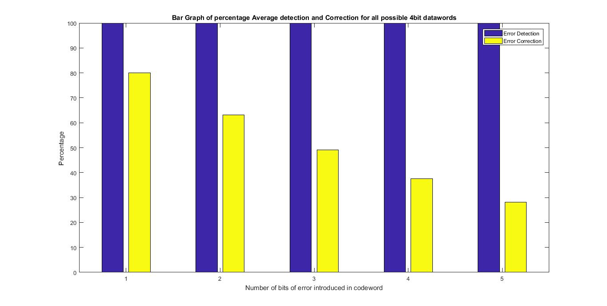
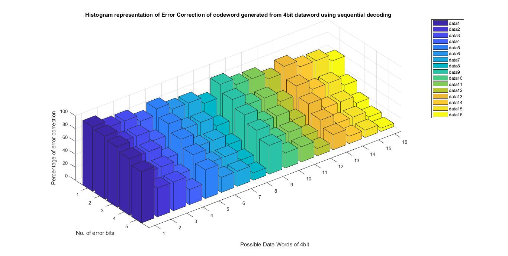

# MATLAB code for convolution code (2, 1, 7) decoding with g1 = 110101 and g2 =  111011  and  the  analysis  of  %  of  error  detection  and  correction  using sequential decoding with threshold upto 5

This repository has codes pertaining to the above question written in MATLAB<br>

In this we have demonstrated the convolutional encoding and decoding process and finally calculated the percentage of error detection and correction<br>

In data communication, a convolutional code is a type of error-correcting code that generates parity symbols via the sliding application of a boolean polynomial function to a data stream. 
The sliding application represents the 'convolution' of the encoder over the data, which gives rise to the term 'convolutional coding.' 
The sliding nature of the convolutional codes facilitates trellis decoding using a time-invariant trellis. 
Time invariant trellis decoding allows convolutional codes to be maximum-likelihood soft-decision decoded with reasonable complexity.<br>

### Requirements
MATLAB must be installed to run the program.<br>
To install MATLAB follow the official site instructions <a>https://in.mathworks.com/downloads/</a><br>

### Steps

1. Clone the repository

    ```
        git clone https://github.com/anmolh123/Convolutional-Encode-Decode.git
    ```
2. Move into the directory  
    
    ```
        cd Convolutional-Encoding-Decoding/
    ```       
3. To run the the program execute file ex.m passing parameter as 4 

    ```
        run ex(4)        //for 4bit dataword generalization
    ``` 

### Files Description

1. ex.m -This is the main function which takes number of bits in dataword as input and returns the percentage of errors detected and corrected
2. encode.m - This function encodes input bit with the help of generating functions
3. decoding.m - This funtion calculates number of cases where error can be corrected
4. detection.m - This funtion calculates number of cases where error can be detected
5. tabl.m - This function calculates and returns the state table of the convolution code for every state with transition on 0 or 1.
6. onebit.m - Function to introduce 1 bit error in codeword
7. twobit.m - Function to introduce 2 bit error in codeword
8. threebit.m - Function to introduce 3 bit error in codeword
9. fourbit.m - Function to introduce 4 bit error in codeword
10. fivebit.m - Function to introduce 5 bit error in codeword


### Working

The function ex.m takes an integer <b>p</b> as input which denotes the number of bits in dataword. Then all the possible binary numbers possible of p input bits number is generated.
All the generated datawords of p bits is then encoded. Then in a loop for all the codewords all the 1,2,3,4 and 5 bits error are introduced and then sent to function decoding.m and detection.m for finding number of corrections and detections respectively.
Then total percentage is calculated and average is found for each bit errors. Finally graph is plotted for percentage detection and correction.
The most important function is tabl.m that stores all the generated codeword from each state if the input bit is 0 and 1.<br> <i>Detailed Explanation given as comments in respective functions</i> <br>

For p = 4 as number of bits in datawords following were the result:-<br>
Time taken (avg.) = 2minutes<br>

Percentage detection separately for all 4bit possible datawords

    ```
        Error bits     1bit  2bit  3bit  4bit  5bit
        0000           100   100   100   100   100
        0001           100   100   100   100   100
        0010           100   100   100   100   100
        0011           100   100   100   100   100
        0100           100   100   100   100   100
        0101           100   100   100   100   100
        0110           100   100   100   100   100
        0111           100   100   100   100   100
        1000           100   100   100   100   100
        1001           100   100   100   100   100
        1010           100   100   100   100   100
        1011           100   100   100   100   100
        1100           100   100   100   100   100
        1101           100   100   100   100   100
        1110           100   100   100   100   100
        1111           100   100   100   100   100
    ```
  
    
Percentage correction separately for all 4bit possible datawords 

    ```
    
        Error bits     1bit      2bit      3bit      4bit      5bit
        0000           100.0000  97.8947   93.6842   87.4923   79.5666
        0001           90.0000   78.9474   67.3684   55.7895   44.6981
        0010           90.0000   78.9474   67.3684   55.7895   44.6981
        0011           80.0000   62.1053   46.6667   33.8287   23.5552
        0100           90.0000   78.9474   67.3684   55.7895   44.6981
        0101           80.0000   62.1053   46.6667   33.8287   23.5552
        0110           80.0000   62.1053   46.6667   33.8287   23.5552
        0111           70.0000   47.3684   30.8772   19.2982   11.4938
        1000           90.0000   78.9474   67.3684   55.7895   44.6981
        1001           80.0000   62.1053   46.6667   33.8287   23.5552
        1010           80.0000   62.1053   46.6667   33.8287   23.5552
        1011           70.0000   47.3684   30.8772   19.2982   11.4938
        1100           80.0000   62.1053   46.6667   33.8287   23.5552
        1101           70.0000   47.3684   30.8772   19.2982   11.4938
        1110           70.0000   47.3684   30.8772   19.2982   11.4938
        1111           60.0000   34.7368   19.2982   10.2167    5.1084
       
    ```

    
Average Percentage detection

    ```
      Errors 1bit  2bit  3bit  4bit  5bit
             100   100   100   100   100
    ```

    
Average Percentage correction    

    ```
      Errors 1bit      2bit      3bit      4bit      5bit
             80.0000   63.1579   49.1228   37.5645   28.1734
    ```


Bargraph of percentage average Error Detection and Correction for all possible 4bit datawords




Histogram Representation of Error Correction of codeword generated from 4bit dataword using sequential decoding




